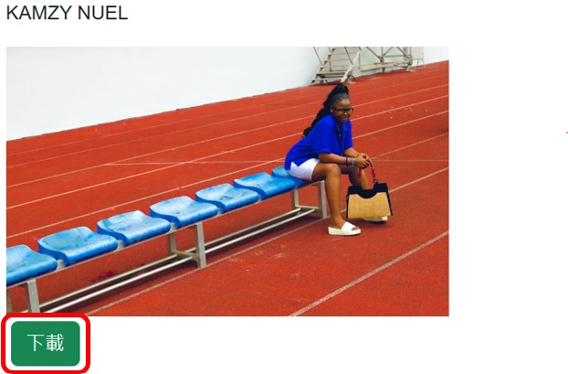

# 照片搜尋網站
1. 本專案框架為React.js，前往[照片搜尋網站](https://picture-search-website-1.onrender.com)
2. 使用AJAX串接第三方網站API (串接的網站為[Pexel](https://www.pexels.com/zh-tw/))
3. 使用Boostrap美化網頁
## 目標
1. 提供使用者搜尋和下載想要的照片
2. 本專案的照片皆為第三方網站Pexel免費授權
## 套件
1. react
2. react-router-dom
3. axios
## 功能
1. React Component包含
   1. 搜尋 (search.js)  
      
   2. 圖片顯示區域 (picture.js)
2. 所使用的API為:  
   1. 搜尋照片 `https://api.pexels.com/v1/search?query=${input}&per_page=15&page=1`
      * 搜尋照片是在input有輸入時會更新的資料，因此要用一個handler來呼叫axios抓取API中的資料並用useState更新
   ```javascript
   const search = async (搜尋照片_URL) => {
      let result = await axios.get(搜尋照片_URL, {
         headers: { Authorization: PEXELSAPIKEY },
      });
      setData(result.data.photos);
   };
   ```
   2. 精選照片 `https://api.pexels.com/v1/curated?page=1&per_page=15`
      * 精選照片是在第一次載入網頁時會更新的資料，因此要用useEffect來呼叫axios抓取API中的資料
   ```javascript
   useEffect(() => {
      search(精選照片_URL);
   }, []);
   ```
   3. PEXELSAPIKEY為向Pexel註冊帳號後，申請的API金鑰，請妥善保管
   4. API_URL中page為當前頁數，per_page為一頁顯示多少照片，query為搜尋的輸入值
3. 從API中可以得到的資料:
   1. 照片
   2. 照片的作者
   3. 照片的下載連結
   4. 下載時照片的大小
   
4. 本專案使用[Render](https://render.com/)網站進行部署，前往[照片搜尋網站](https://picture-search-website-1.onrender.com)
## 問題
如何將search中useState的資料，顯示到picture component中?
1. 將useState以及AJAX串接API的操作，全部State Lifting到主頁(Home.js)來完成
2. 再將所有結果以props回傳到search.js和picture.js中
